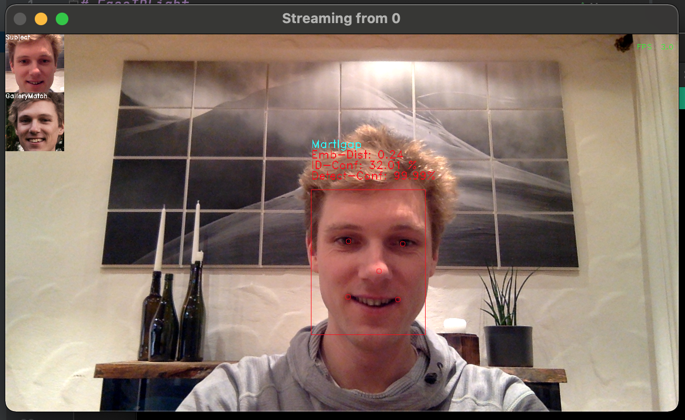

# FaceIDLight
[](https://github.com/psf/black)
[](https://img.shields.io/github/contributors/martlgap/FaceIDLight?color=green)
[](https://img.shields.io/github/last-commit/martlgap/FaceIDLight)
[](https://img.shields.io/badge/license-MIT-blue)
[](https://img.shields.io/github/downloads/Martlgap/FaceIDLight/total)
[](https://github.com/Martlgap/FaceIDLight/actions/workflows/ci-testing.yml)


## 📘 Description
A lightweight face-recognition toolbox and pipeline based on tensorflow-lite with MTCNN-Face-Detection 
and ArcFace-Face-Recognition. No need to install complete tensorflow, tflite-runtime is enough. All tools are
using CPU only.

Pull request are welcome!


## ⚡️ Features 
- Online Face-Recognition
- Running completely on CPU
- Multi Faces
- ~4 FPS on a MacBookPro2015
- Tools for Face-Detection, -Verification and Identification


## ✅ ToDos
- [ ] GPU support
- [ ] Resolution-dependent model-selection
- [ ] Multithreading for multiple faces
- [ ] Fix bug installing with setup.py (not finding external url for tflite-runtime)
- [x] OpenCV Window freezes on MacOS when quitting (seemed to be fixed)


## 🥣 Requirements
- [Python 3.9](https://www.python.org/)
- [TensorflowLite-Runtime 2.5.0](https://www.tensorflow.org/lite/guide/python)

## ⚙️ How to install the FaceIDLight as a package
Simply install the package via pip from git:
```zsh
pip3 install git+https://github.com/martlgap/FaceIDLight
``` 
or if you do not have git installed on your system, install it directly from the wheel:
```zsh
pip3 install https://github.com/Martlgap/FaceIDLight/releases/download/v.0.1/FaceIDLight-0.1-py3-none-any.whl
``` 

## ⚙️ How to use the FaceIDLight as Repo
Clone the repository, init a virtual environment and install the requirements:
```zsh
git clone https://github.com/Martlgap/FaceIDLight.git
cd FaceIDLight
python3.8 -m venv venv
pip3 install -r requirements.txt
```

## ⚙️ How to install tflite-runtime
If you have troubles to install tflite-runtime:

You can easily install tflite-runtime from https://google-coral.github.io/py-repo/ with the following line:
```zsh
pip3 install tflite-runtime==2.5.0 --find-links https://google-coral.github.io/py-repo/tflite-runtime
```

## 🚀 Run Demo:
Run Python 3.8 and type in:
```python
from FaceIDLight.demo import Demonstrator
Demonstrator().run()
```
You can select your own directory for gallery-images (*.png and *.jpg images are supported) by simply add 
a keyword argument to the Demonstrator Class: `Demonstrator(gal_dir=<full-path-to-your-gallery>)`

You might change the webcam address ID. Do so via selecting a certain number for stream id:
`Demonstrator(stream_id=<-1, 0, 1, 2, ...>)`

Test the face-identification by simply holding a foto into camera. The provided sample_gallery includes images 
from: (Andrew_Caldecott, Anja_Paerson, Choi_Sung-hong, Elizabeth_Schumacher, 
Eva_Amurri, Jim_OBrien, Raul_Ibanez, Rubens_Barrichello, Takahiro_Mori)

Press "q" to close the Demo. (Window has to be selected)


## 📺 Example
This image shows an example of the `Demonstrator()`:



## 🙏 Acknowledgement
- Thanks to Iván de Paz Centeno for his [implementation](https://github.com/ipazc/mtcnn) 
  of [MTCNN](https://arxiv.org/abs/1604.02878) in [Tensorflow 2](https://www.tensorflow.org/). 
  The MTCNN model weights are taken "as is" from his repository and were converted to tflite-models afterwards.
- Thanks to Kuan-Yu Huang for his [implementation](https://github.com/peteryuX/arcface-tf2) 
  of [ArcFace](https://arxiv.org/abs/1801.07698) in [Tensorflow 2](https://www.tensorflow.org/).
- We trained all provided models with the [MS1M](https://arxiv.org/abs/1607.08221) dataset.


## 📚 BibTex
If you use our trained models and want to cite our work feel free to use this:
[Image Resolution Susceptibility of Face Recognition Models](https://arxiv.org/abs/2107.03769)

>@inproceedings{Knoche2021ImageRS,<br>
  title={Image Resolution Susceptibility of Face Recognition Models},<br>
  author={Martin Knoche and Stefan Hormann and Gerhard Rigoll},<br>
  year={2021}<br>
}
